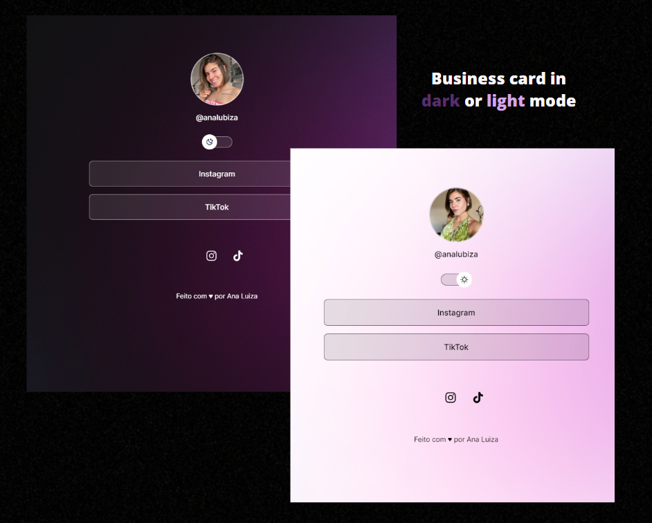

<h1 align="center"> Business Card </h1>

# Sobre o projeto 💭
O cartão de visitas digital é meu primeiro projeto nessa área, foi um desafio e tanto, aprendi a utilizar o Git, Github e Figma. 

## Como acessar o projeto? 🤔

Basta clicar [AQUI](https://analudms.github.io/FirstProject/) que você será direcionado!

## Apresentação 👀

  

## Tecnologias 💻
- HTML e CSS.
- JavaScript.
- Git e Github.
- Figma.

## Layout

Você pode visualizar o layout do projeto através [DESSE LINK](https://www.figma.com/file/3M9OT7oaq5ZTEbUCE91O5J/DevLinks-%E2%80%A2-Projeto-Discover-(Community)?type=design&node-id=1437-513&mode=design&t=GGDYN4Na90rmsqmg-0). É necessário ter conta no [Figma](https://figma.com) para acessá-lo.

# Inspiração 💡

Projeto feito a partir de uma vídeo aula gratuita da Rocketseat 💜. 
https://app.rocketseat.com.br/discover

# Autor 👩🏻

Ana Luiza de Melo Soares.  
https://www.linkedin.com/in/ana-luiza-melo-8b94181b3/